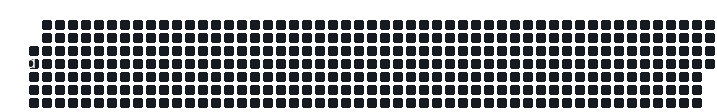

## Usage
```
git clone https://github.com/ARKANYOTA/BadAppleDrawer
cd BadAppleDrawer
```
==> Trouver une video a afficher  
==> Changer les valeurs de main.py a la convenance: `vim main.py` (Le vi, vim ou nvim **obligatoire**)
```
python main.py
```

==> Voir quel est la plus grande image: `ls`  
==> Changer les valeurs drawer.py a la convenance: `vim drawer.py`
```
git clone https:github.com/ARKANYOTA/DrawOnGithubActivity
git clone <La ou voulez clone que ça soit remlis de commit tel: https://github.com/ARKANYOTA/BadAppleDraw1980-2010.git>
python drawer.py
```

==> Si vous avez des erreur démerdez vous.


## Render: en video

```
python visual.py
```

ça donne un video, et des photo, j'ai pris les photos et mis sur un truc online pour avoir un gif


